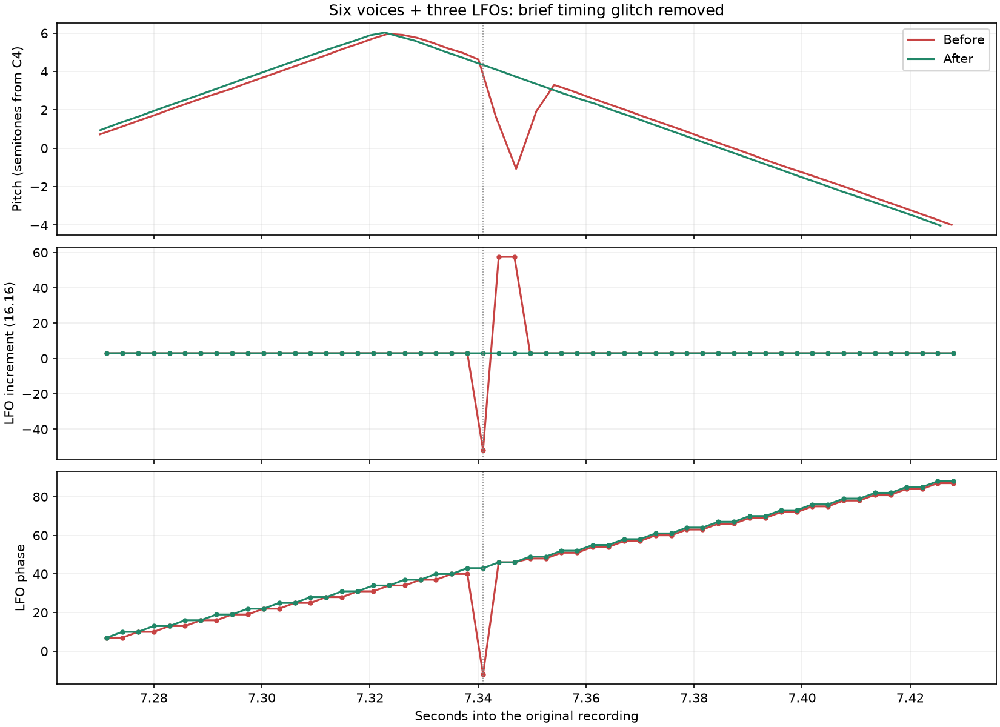

# Monomachine modulation clock and host receive timing

This change addresses two reproduced failures in Monomachine OS 1.32b: frequent clock stalls producing stepped pitch sweeps, and a rarer backwards pitch jump with six voices and three LFOs active. The required core changes are in [mc68k PR #4](https://github.com/joelanders/mc68k-md-mm/pull/4).

## Failures and implementation

The previous Monomachine host path buffered DSP output, queued up to 16 host words, and requested service after three words. Its runtime notifications contain a voice word and a wrapping block clock. With inherited 68020 instruction timings, the firmware could miss a complete modulo-32 clock wrap and calculate a zero modulation increment. The companion core change repairs reentrant receive-word publication and supplies documented ColdFire core timings. This integration uses the native DSP transmit register and host receive latch, paced by HTDE, with a one-word receive-request threshold when RREQ is enabled. The board clock stays at 40 MHz. The Machinedrum transport retains its existing queue/threshold behavior.

A six-voice fixture then exposed a second problem. A DSP running ahead of CPU time published its notification immediately. The CPU entered the interrupt handler and read the second word before the DSP wrote it, receiving zero in place of the clock. All three active LFOs briefly received a negative increment. At the failing read, the producer was 2,719 DSP cycles ahead of the CPU's target and stopped immediately before writing the clock word. Three diagnostic captures reproduced byte-identical audio.

`TimedHostRx` reserves the host latch while retaining a word's production timestamp. `Hardware::hostRxReadyCycle` converts DSP time through the scheduler's existing boot origins and clock ratio, rounding up. The word becomes CPU-readable, and can raise HREQ, only when CPU time reaches that deadline. A deferred and a readable host word cannot occupy the latch simultaneously; a second word waits in HOTX. The host pump keeps checking a deferred word even without a new peripheral edge. Boot behavior before the DSP origin is established remains immediate.

No ROM-address condition, firmware patch, tuning override or enlarged receive FIFO is part of this change.

## Evidence and limits



This figure is from the original fix series before integration onto release commit `53d715ed`. It is evidence for the reproduced failure and fix, not an audio capture from the rebased PR head. In the failing nine-second capture, all three LFOs had one observed negative increment (`0xffcc4000`) and an invalid phase (`65524`, signed -12), near 7.341 seconds. The fixed capture has none. Maximum aligned pitch-curve error falls from 2.365% to 0.135% of the sweep span. An average-error threshold alone accepted the brief glitch; the additional sampled-state checks reject it.

The earlier validation completed 25 isolated modulation/envelope/block-size cases, two nine-second six-voice cases, and two 60-second load cases plus release tails. The PR description records the fresh release-integration rerun separately. The original failing control is retained and must still fail the strengthened checks.

The cases cover all three LFO slots, pitch/volume/pan/synth-tuning targets, slow/fast/zero speed, zero/small depth, FREE/HOLD/ONE/HALF/TRIG, summed pitch modulation, LFO-to-LFO depth modulation, finite envelope hold, release during attack, rapid amplitude/filter retriggers, and native 32/1024/irregular processing blocks. The load fixture verifies five additional sounding GND-SIN voices on CD while the measured track is isolated on AB. It is not a worst-case FM/effects benchmark.

The fixture is tempo 120, MIDI note 60/velocity 100 every two seconds with a 1.5-second gate, LFO MULT 32x/SPD 32, triangle/TRIG, zero interlace. Three-source routes are LFO1 to PTCH/16OC, LFO2 to AMP/VOL, and LFO3 to AMP/PAN, each at depth 16. Other cases vary specified controls. Test NVRAM is disposable: the private seed's invalid master-tuning field is corrected only in that copy. The application contains no such override.

Repeatability is checked through pitch, amplitude-envelope and spectral-centroid curves. Each repeated note permits one constant alignment shift, bounded to 12 ms, without time warping. LFO periods are checked independently within notes. FREE and HOLD intentionally start at different phases on successive notes and have different acceptance criteria. These are consistency/behavior checks, not measurements of hardware accuracy. State probes occur at audio-block boundaries and can miss a shorter event between observations.

## Automated tests

The existing [MD/MM core workflow](../.github/workflows/mdmm-core.yml) now builds and runs these added regressions:

- `mc68kColdFireTimingTest`: 28 instruction cases under ColdFire and 68020, with branch outcomes/destinations.
- `mc68kHdi08ReceiveTest`: receive ordering during callback reentry in both byte orders.
- `mc68kColdFireDivideTest`: existing divide/remainder checks.
- `mdHostRxTimingTest`: future-word visibility, capacity, ordering, exact-cycle readiness, 64-bit deadlines and cycle zero.

Using the workflow's headless CMake configuration:

```sh
cmake --build build-mdmm-core --parallel 4 --target mc68kColdFireTimingTest mc68kHdi08ReceiveTest mc68kColdFireDivideTest mdHostRxTimingTest
ctest --test-dir build-mdmm-core --output-on-failure --no-tests=error --tests-regex '^(mc68kColdFireTimingTest|mc68kHdi08ReceiveTest|mc68kColdFireDivideTest|mdHostRxTimingTest)$'
```

`mdHostRxTimingTest` checks the small deferred-latch contract; it does not instantiate the complete scheduler. The firmware/audio runs provide the end-to-end evidence. `mdAudioFirmwareTest` requires user-supplied `GEARMULATOR_MD_FIRMWARE_BIN` and `GEARMULATOR_MM_FIRMWARE_BIN` paths and covers state round trips, three rates, three resamplers, hostile blocks and queue bounds. It skips when firmware is absent. `mdUwFirmwareTest` additionally covers MD 1.63 ROM/RAM audio. Proprietary firmware/NVRAM are not distributed with these tests.

## Independent review

Review the receive-request timing, conversion between processor clocks, native latch capacity, callback reentry, and the scope of ColdFire timing changes. The core model assumes cache hits/zero-wait operand accesses; unmodeled instructions and most exceptions retain inherited estimates. Exact bus/cache timing and direct hardware waveform parity remain unverified.

The open [firmware-hooks draft #43](https://github.com/joelanders/gearmulator-md-mm/pull/43) and [mc68k draft #3](https://github.com/joelanders/mc68k-md-mm/pull/3) overlap this area. This PR is based on the release branch and does not include either draft. Combining them requires explicit conflict resolution and retesting. Further coverage gaps include complex FM/effects loads, external MIDI-clock changes, and modulation during pattern/kit/state transitions.
